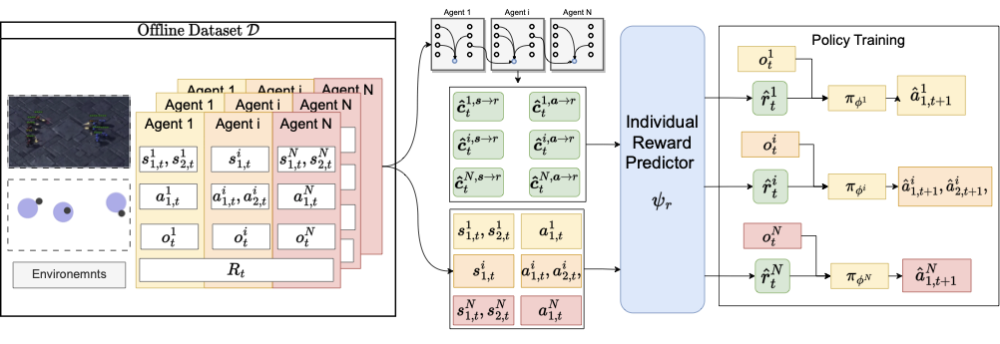
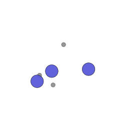
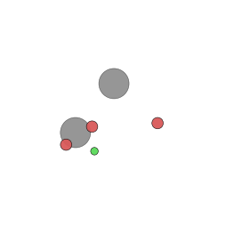
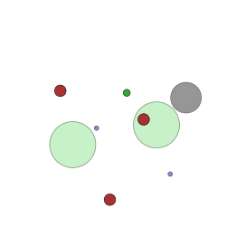

<h1 align="center">MACCA: Aprendizaje por Refuerzo Multi-Agente Offline con Asignación de Crédito Causal</h1>

<p align="center">
  <a href="https://openreview.net/forum?id=gwUOzI4DuV"></a>
  <a href="https://arxiv.org/abs/2312.03644"></a>
  
</p>

<p align="center">
  <b><a href="https://openreview.net/forum?id=gwUOzI4DuV">Publicado en Transactions on Machine Learning Research (TMLR), 2025</a></b><br>
  Ziyan Wang, Yali Du, Yudi Zhang, Meng Fang, Biwei Huang
</p>

> **TL;DR** — En el aprendizaje por refuerzo multi-agente (MARL) cooperativo offline, los agentes solo observan una recompensa compartida del *equipo*, por lo que no está claro qué agente merece el crédito. **MACCA** modela el proceso generador de datos como una **Red Bayesiana Dinámica** sobre estados, acciones y recompensas, aprende la **estructura causal** y una **función de recompensa individual** a partir de los datos offline, y utiliza las recompensas recuperadas por agente para guiar el aprendizaje de políticas. Se integra en cualquier backbone de MARL offline; proporcionamos **MACCA-OMAR**, **MACCA-CQL** y **MACCA-ICQ**.

<p align="center">
  
</p>
<p align="center"><i>MACCA aprende la estructura causal y un predictor de recompensa individual ψ<sub>r</sub> a partir del conjunto de datos de recompensa del equipo offline, y luego entrena la política de cada agente con las recompensas individuales recuperadas.</i></p>

<p align="center">
  
  &nbsp;
  &nbsp;
</p>
<p align="center"><i>Políticas de MACCA en MPE — Navegación Cooperativa · Depredador-Presa · Simple-World</i></p>

---

## Método

El MARL offline con solo una recompensa de equipo `R_t` oculta la contribución individual de cada agente. MACCA aborda esto en dos etapas:

1. **Aprendizaje del modelo causal.** Tratamos el entorno como una Red Bayesiana Dinámica y aprendemos (a) una *estructura causal dinámica* `ψ_g(s_t, a_t, i)` — las dimensiones de estado/acción de qué agentes influyen causalmente en la recompensa — y (b) un *predictor de recompensa individual* `ψ_r` de modo que las recompensas predichas por agente sumen la recompensa de equipo observada. Bajo la configuración de conjunto de datos offline, se demuestra que estos son **identificables**.
2. **Aprendizaje de política con conciencia de crédito.** Las recompensas individuales recuperadas reemplazan a la recompensa de equipo en cualquier optimizador de MARL offline, produciendo una asignación de crédito precisa e interpretable sin ajustar un estimador de ventaja/valor adicional.

Este repositorio proporciona tres instanciaciones: **MACCA-OMAR**, **MACCA-CQL** y **MACCA-ICQ**.

## Instalación

```bash
# MPE (Cooperative Navigation / Predator-Prey / Simple-World)
conda create -n macca python=3.7 -y && conda activate macca
cd mpe
pip install -r requirements.txt                      # torch 1.12 (CUDA sm<=86 / A100), gym 0.9.4
pip install -e multiagent-particle-envs              # the MPE environments

# SMAC (StarCraft II) — separate env:
conda env create -f environment.yml && conda activate smac
cd smac
bash install/install_sc2.sh                          # installs StarCraft II 4.10 + maps
```

## Conjuntos de Datos

Cuatro calidades de datos offline por entorno — **Random**, **Medium-Replay**, **Medium**, **Expert** — donde las recompensas individuales están ocultas y solo se almacena su suma (la recompensa del equipo).

- **MPE**: colóquelos en `mpe/datasets/<env>/<quality>/seed_<k>_data/` (PP/World también requieren `pretrained_adv_model.pt`, la política de la presa utilizada en la evaluación).
- **SMAC**: coloque los archivos `.h5` bajo `smac/offline_datasets/`
  (enlace de descarga en `smac/README.md`).

## Uso

Los ejemplos listos para ejecutar (solo MACCA) se encuentran en [`examples/`](examples):

```bash
bash examples/mpe_cooperative_navigation.sh   # MACCA-OMAR on CN  (simple_spread)
bash examples/mpe_predator_prey.sh            # MACCA-OMAR on PP  (simple_tag)
bash examples/mpe_world.sh                    # MACCA-OMAR on WORLD (simple_world)
bash examples/smac_2s3z.sh                    # MACCA-OMAR on SMAC 2s3z
bash examples/smac_5m_vs_6m.sh                # MACCA-ICQ  on SMAC 5m_vs_6m
bash examples/smac_6h_vs_8z.sh                # MACCA-OMAR on SMAC 6h_vs_8z
```

Cambia el algoritmo / calidad con `--algorithm_name {causal_omar,causal_cql}` (MPE) o `--config={macca_omar,macca_icq,macca_cql}` y `h5file_suffix={expert,medium,medium_replay,random}` (SMAC). Renderiza un GIF de demostración de una política MPE entrenada añadiagregando `--save_gif`.

## Cita

```bibtex
@article{wang2025macca,
  title   = {{MACCA}: Offline Multi-agent Reinforcement Learning with Causal Credit Assignment},
  author  = {Wang, Ziyan and Du, Yali and Zhang, Yudi and Fang, Meng and Huang, Biwei},
  journal = {Transactions on Machine Learning Research},
  year    = {2025},
  url     = {https://openreview.net/forum?id=gwUOzI4DuV}
}
```

## Agradecimientos

Los conjuntos de datos offline de MPE y el backbone de OMAR se basan en [OMAR](https://github.com/ling-pan/OMAR) / [CFCQL](https://github.com/thu-rllab/CFCQL); la pipeline de SMAC se basa en [PyMARL2](https://github.com/hijkzzz/pymarl2). Agradecemos a los autores por liberar su código.
